# Image Search - CBIR sử dụng mạng VGG16.

## Giới thiệu
Dự án này là một hệ thống tìm kiếm hình ảnh dựa trên nội dung (Content-Based Image Retrieval - CBIR). Hệ thống cho phép người dùng tìm kiếm hình ảnh tương tự bằng cách sử dụng hình ảnh đầu vào.

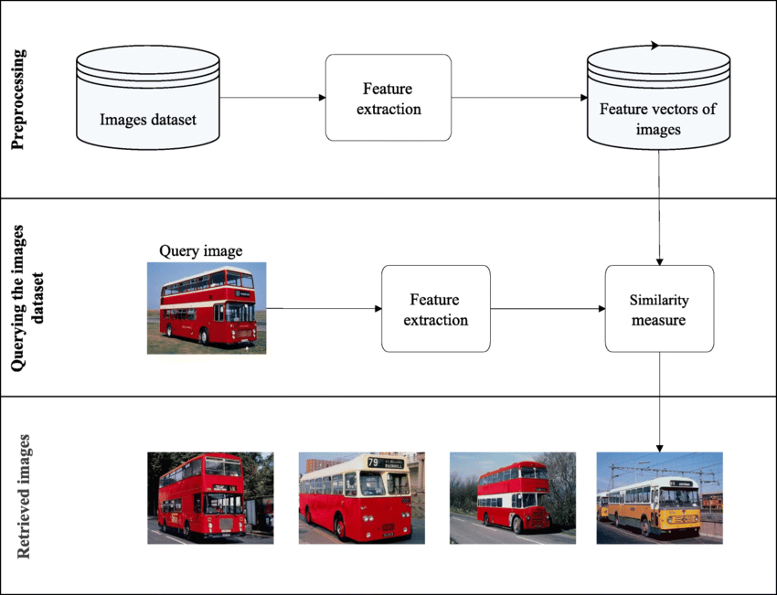
## Tính năng
- Tìm kiếm hình ảnh tương tự từ một tập hợp hình ảnh lớn.
- Hiển thị hình ảnh tương tự với tiêu đề và thông tin liên quan.

## Cài đặt
1. Clone repository:
   ```bash
   git clone https://github.com/LeThang15081994/_ImageSearch-CBIR.git
   cd _ImageSearch-CBIR
   ```
2. Cài thư viện:
   ```bash
   pip install -r requirements.txt
   
## Trích xuất đặc trưng:
### 1. Trích xuất đặc trưng từng ảnh thành vector:
   ```bash
def img_preprocess(seft, img): # image preprocessing convert to tensor
  img = img.resize((224,224)) 
  img = img.convert('RGB') 
  x = image.img_to_array(img)
  x = np.expand_dims(x, axis = 0) # add batch_size axis
  x = preprocess_input(x) # image normalized
  return x

def vector_normalized(self, model, img_path): # extract vector and normalized
  print('processing...............................................', img_path)
  img = Image.open(img_path)
  img_tensor = self.img_preprocess(img)

  vector = model.predict(img_tensor)[0] # get vector from 2D to 1D
  vector = vector / np.linalg.norm(vector) # normalized
  print('processed !!!', img_path)
  return vector
   ```
### 2. Lưu trữ các vector hình ảnh sử dụng thư viện pickle:
   ```bash
# new method to store vectors
vectors = []
paths = []

for img_path in os.listdir(data_path):
      img_path_full = os.path.join(data_path, img_path)
      img_vector = self.vector_normalized(model, img_path_full)
   
      vectors.append(img_vector)
      paths.append(img_path_full)

print("Saving............................................")
with open('vectors.pkl', 'wb') as f:
   pickle.dump(vectors, f)
with open('paths.pkl', 'wb') as f:
   pickle.dump(paths, f)

print("Vectors and paths saved.")
   ```
### 3. Trích xuất đặc trưng hình ảnh Query và tính toán khoảng cách giữa vector hình ảnh Query và kho vector hình ảnh dataset:
   ```bash
image = feature_extract()
model = image.get_model_extract()
img_search_vector = image.vector_normalized(model, img_path)

with open("vectors.pkl", "rb") as f:
  vectors = pickle.load(f)
with open("paths.pkl", "rb") as f:
  paths = pickle.load(f)

distance = np.linalg.norm(vectors - img_search_vector, axis=1)

ids = np.argsort(distance)[:index] # get 20 image have nearest image.
nearest_image = [(paths[id], distance[id]) for id in ids]

return nearest_image
```
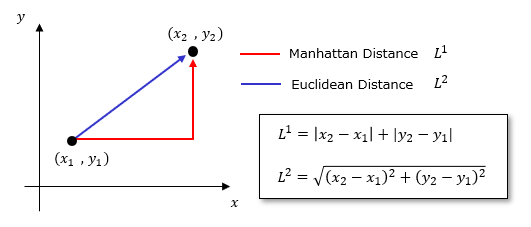
### 4. Kết quả:
Hình ảnh đầu vào:

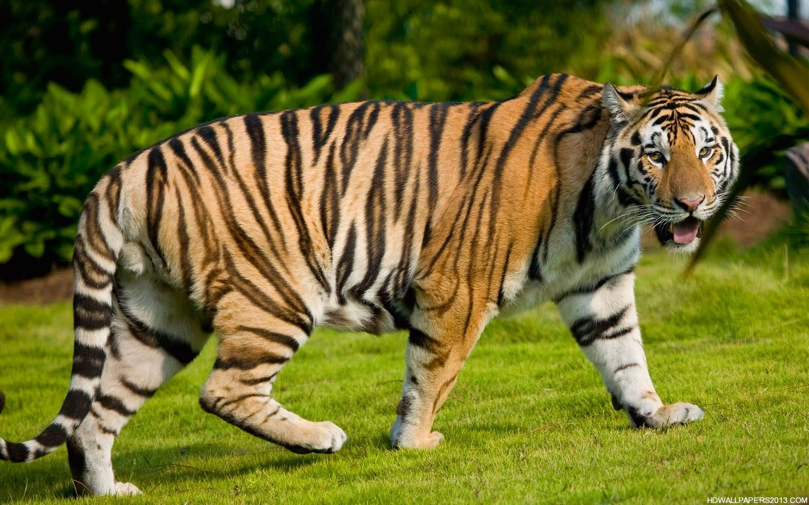

Kết quả search:

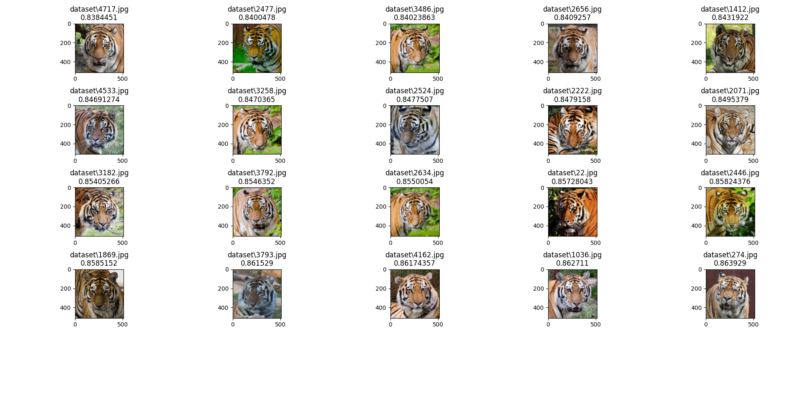
Tương tụ khi search với fox:

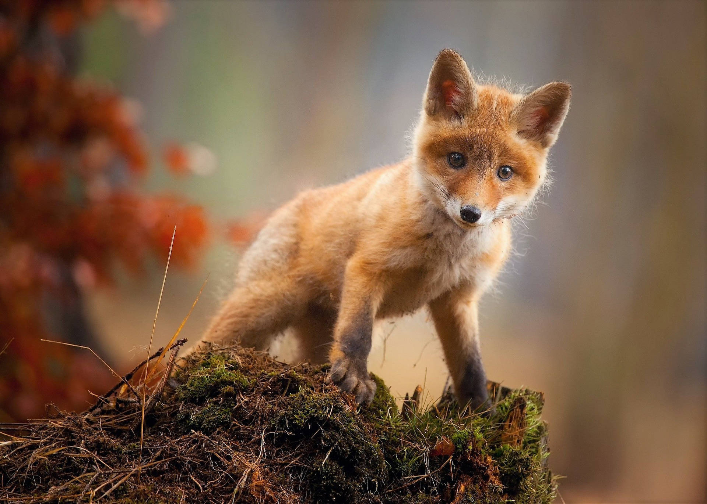

Kết quả search:
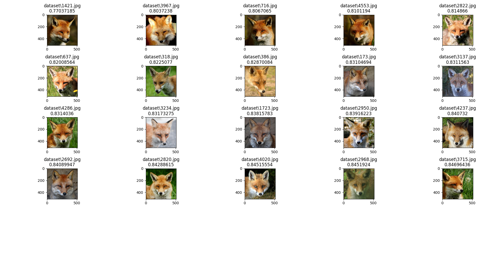
Lion:

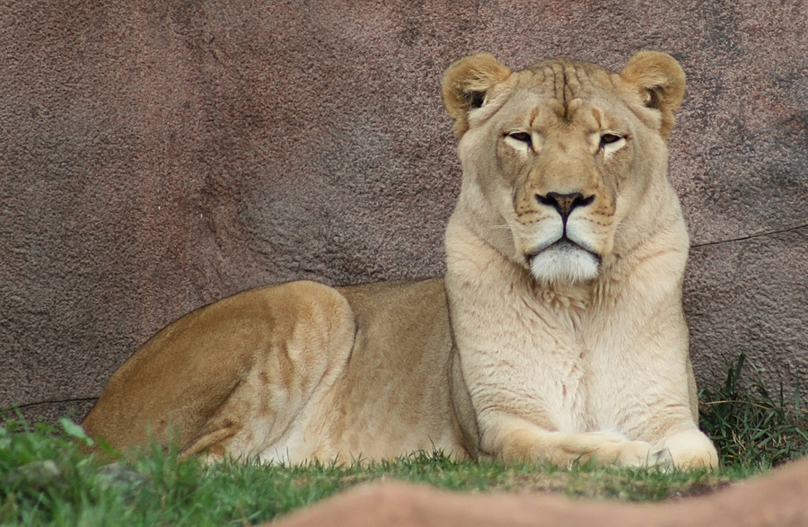

Kết quả search:

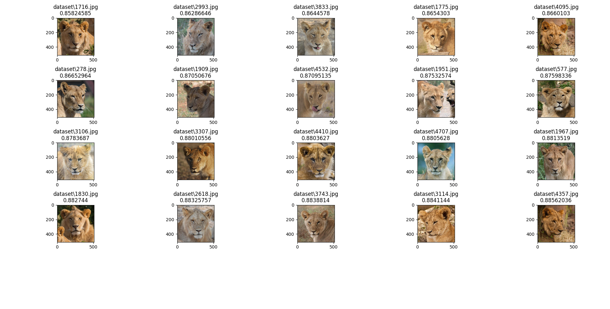
Cheetah:

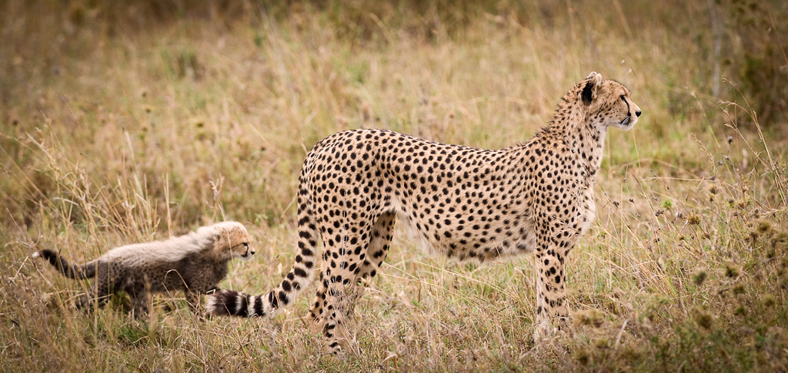

Kết quả search:

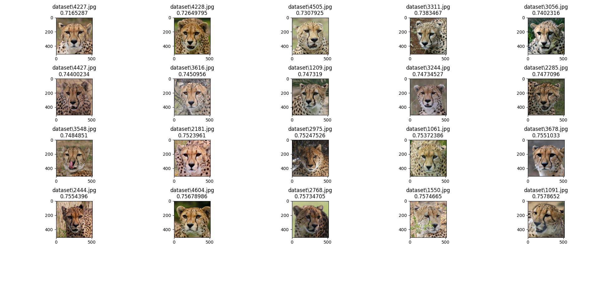
Wolf:

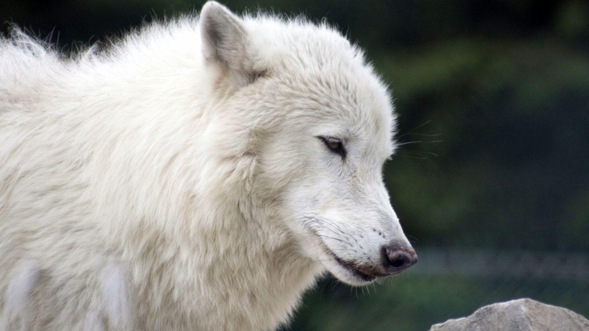

Kết quả search:

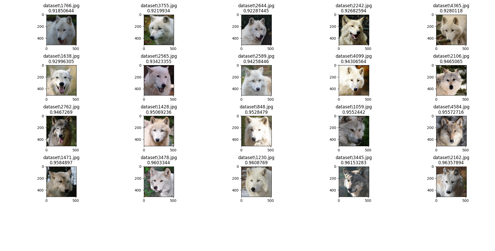

